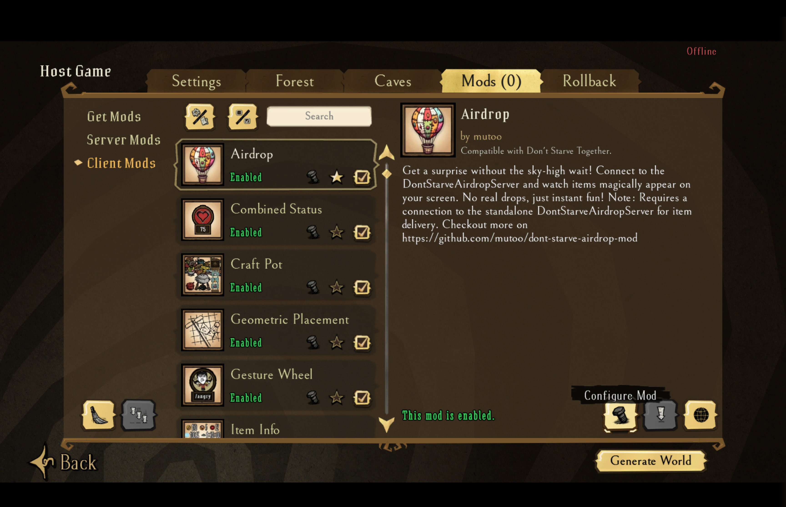
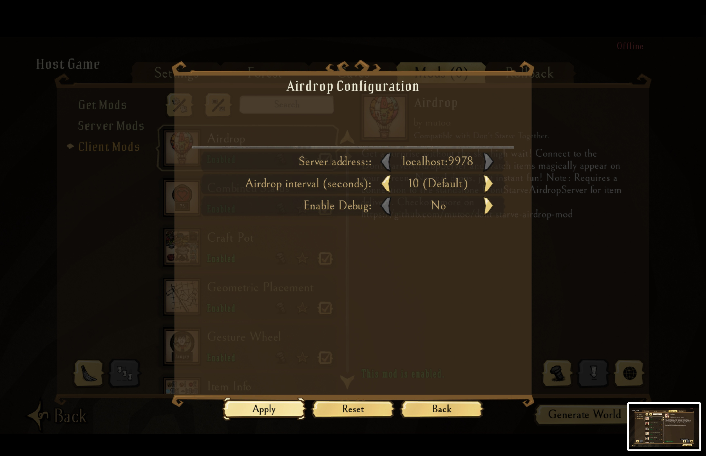
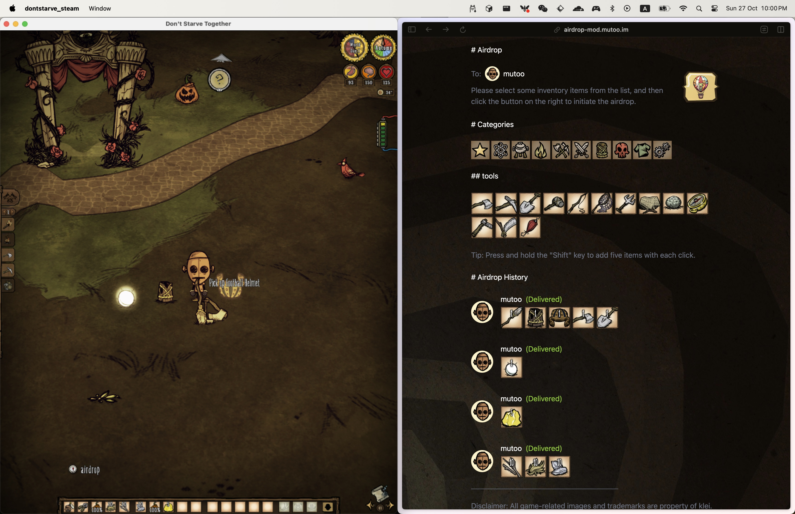

# Don't Starve AirDrop Mod 

This is a mod for Don't Starve (and DST) that allows players to send items to game via a web app.

## Screenshot

## Features

- Mod: a slim mod which is polling supplies from airdrop server every 10 seconds.
- Server: a self host server running on the same machine to communicate with the mode.
- Client: a web interface to communicate with local airdrop server, allow collecting items ready for next airdrop.

## Usage

### Install mod

First, you will need to install the mod either from the steam [workshop](https://steamcommunity.com/sharedfiles/filedetails/?id=3355586316) or directly download it from [github release page](https://github.com/mutoo/dont-starve-airdrop-mod/releases).

Ensure the mod is installed in your Don't Starve (or DST) game folder:

* Windows: `C:\Program Files (x86)\Steam\steamapps\common\Don't Starve Together\mods`
* MacOS: `~/Library/Application Support/Steam/steamapps/common/Don't Starve Together/dontstarve_steam.app/Contents/mods`

Enable the mod when you start a new game.

### Install server

The airdop server is required to communicate with the mod. The mod will keep polling the items from the server every 10 seconds (by default).

Please install the latest server from the github release page.

The server is a standalone executable file, once started, it runs at http://localhost:9987.

### The Web Client

You don't need to host the web interface by your own. Once the airdrop server is running, open https://airdrop-mod.mutoo.im in the browser windows on the same computer and it should works.

Now you can select any items in the list, and then drop it in the game. Enjoy the adventure!

## Project Structure

- `dont-starve-airdrop-mod/` - The don't starve mod that query the server for items to airdrop
- `dont-starve-airdrop-server/` - The node.js server for holding the items to airdrop and communicating with the don't starve game
- `dont-starve-airdrop-client/` - The React web app for sending items to the server
- `dont-starve-assets-extractor/` - The handy tool for extracting inventory assets from the don't starve game

### Arch

## Disclaimer

All game-related images and trademarks are property of klei.
